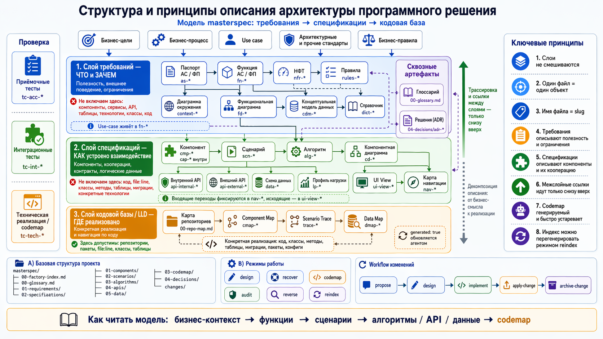

# masterspec-skills

Набор скиллов для описания фабрик (автоматизированных систем) по мета-модели masterspec — и для строгой, мультиагентной генерации спецификаций, пригодных для перехода к коду.



> Скиллы работают напрямую с файловой системой. Из среды нужны стандартные `bash`/`git` и (для оркестраторов) встроенный механизм субагентов harness'а; внешних CLI, сервисов или API набор не требует.
>
> Каждый скилл = `SKILL.md` + его `references/`: при выполнении операции references обязательны (промпты ролей, контракты вызова субагентов, алгоритмы мержа) — это часть скилла, не опциональное чтение.
>
> **Harness-примитивы и fallback (единый контракт):** оркестраторы (`derive`/`evolve`) используют механизм субагентов (`Task`) — без него работают последовательно по одному элементу. Lifecycle-скиллы (`apply-change`/`archive-change`) используют `AskUserQuestion` для подтверждений и выбора — без него задают тот же вопрос текстом и ждут явного ответа человека, не угадывая. Никакой скилл не требует внешних CLI.
>
> kernel `masterspec` держит и справку (мета-модель, шаблоны), и НОРМЫ (чек-лист артефакта, дисциплина слоёв, формат change.md, алгоритм индекса). «Не делает» значит «не запускает операций сам» — но его нормы обязательны к соблюдению операциями.

## Принцип набора
- **kernel `masterspec` = СПРАВОЧНИК**: мета-модель (3 слоя), 29 шаблонов, дисциплина слоёв, паттерны-references. Сам не «делает».
- **операции = скиллы-ГЛАГОЛЫ**. Вариации одного назначения = ПАРАМЕТР скилла, не новый скилл.
- **паттерны процесса = references** внутри kernel, не отдельные скиллы.

## Скиллы

Полный набор. `👤` — запускает человек, `🤖` — вызывается только изнутри других скиллов.

| Скилл | Вызов | Назначение |
|---|---|---|
| `masterspec` (kernel) | 👤 справочник | мета-модель (3 слоя), 29 шаблонов, дисциплина слоёв, паттерны-references. Сам не «делает» |
| `explore` | 👤→🤖 | structured research массива: кода (`source=code`) или сырья в `00-source-data` (`source=docs` — опись и разметка материалов, потом извлечение по слоям). Параллельные read-only субагенты → агрегат в `.research/`. Отдельно и как первый шаг `derive`/`evolve`/`recover` |
| `recover` | 👤 | восстановить описание из того, что уже есть: `source=docs` \| `code` \| `both`. При `both` — сверка заявленного (документы) с фактическим (код); расхождения — отдельный класс находок. Помечает происхождение (`provenance`) и «Белые пятна» |
| `derive` | 👤 | породить слой: требования (`layer=req`) или спецификации (`layer=spec`). Оркестратор: разворачивает слой на элементы, зовёт `gen`, гонит `verify`, ставит human-gate |
| `gen` | 🤖 | сгенерировать ОДИН артефакт (узел-исполнение: 1 артефакт = 1 субагент с изолированным фокус-набором). Человек не вызывает |
| `verify` | 👤 и 🤖 | вычитка по осям O1–O5 (+O0/O6/O7 для spec): дыры с severity + телеметрия. Внутри `derive`/`evolve` включается сама, отдельно — как аудит слоя или при миграции |
| `accept` | 👤 | закрыть слой после вычитки: гейт остатка → отложить остаток в §7 «Белые пятна» → промоушен чистых артефактов `draft→actual` → reindex. Содержание не правит |
| `evolve` | 👤 | внести точечное изменение: impact, scope-fence, немой вердикт/подъём, проверка-вверх. Сам заводит `change` в карантине |
| `apply-change` | 👤 | влить согласованный change (diff-блоки + `new/`) в дерево артефактов, проставить `actual`, обновить индекс |
| `archive-change` | 👤 | перенести завершённый change в `changes/archive/YYYY-MM-DD-<name>/` |
| `migrate` | 👤 | переразложить артефакт на текущую schema-first/нотационную форму (api/data → сайдкар, scn → `notation`, alg → `form`). Без домысла: неоднозначное → `MIGRATE-TODO`, результат всегда `draft` |
| `expose` | 👤 | спроецировать полную спеку библиотеки в потребительский usage-контракт («как пользоваться», без внутреннего устройства); `generated`-вид, руками не правится |
| `pack` | 👤 | собрать guardrail-пакет из корпоративного документа (manifest + карточки правил), опц. вписать путь в `masterspec-config.yaml` фабрики |
| `testgen` | 👤 | из спеки + её `tc-`артефактов собрать ИСПОЛНЯЕМЫЕ автотесты в отдельный репозиторий. Брат `implement`; `tc-` не генерит |
| `impl-plan` | 👤 | технический проект реализации change: `design.md` + `tasks.md`. Скилл кодинга, у границы набора |
| `implement` | 👤 | исполнить `tasks.md` change'а: код, отметки в плане, сборка/тесты/линтер перед завершением. Скилл кодинга, у границы набора |

Полные имена на диске — `masterspec-<глагол>` (`masterspec-derive`, `masterspec-verify` и т.д.); в таблице и тексте они для краткости названы глаголом.

Граница набора: `impl-plan` и `implement` — скиллы кодинга. masterspec доводит дело до согласованной спеки; писать код продукта — уже за границей (можно и внешним инструментом).

## Селекторы и параметры

**Сквозные флаги** (встречаются у нескольких скиллов):

| Флаг | Значения | Что означает |
|---|---|---|
| `layer=` | `req` \| `spec` \| `change` | слой, с которым работаем: требования (ЧТО) \| спецификации (КАК) \| каскад одного изменения. Общий селектор `derive`/`verify`/`accept` |
| `context=` | `lean` (по умолч.) \| `full` | как скилл держит контекст: `lean` — сам почти ничего не читает, делегирует субагентам (рост контекста не зависит от размера фабрики); `full` — оркестратор читает сам (меньше субагент-оверхеда, нужен большой контекст) |
| `pass=` | `linear` (по умолч.) \| `parallel` | темп прогона: по одному элементу с контролем каждого шага \| независимые элементы разом несколькими субагентами, человек проверяет результат целиком |

**По скиллам** (в скобках — необязательное):

| Скилл | Аргументы |
|---|---|
| `masterspec` | `[что нужно: мета-модель \| шаблон \| дисциплина слоёв \| карта скиллов]` |
| `explore` | `[source=code\|docs]` `[target=factory-spec\|factory-change]` `roots=<пути к коду>` \| `docs=<пути к материалам>` `[factory=<slug>]` `[name=<change>]` `[anchor=<paths\|slugs>]` — `source` выбирает массив: код режется по путям, сырьё — по материалам (сначала опись, потом извлечение). `target` выбирает охват: вся фабрика или зона изменения |
| `recover` | `source=docs\|code\|both` `[roots=<пути кода>]` `[docs=<пути к материалам, дефолт 00-source-data>]` `[context=]` — `docs`: сырьё разбирает `explore source=docs`; `code`: обратное восстановление спеки + codemap (нужен `roots=`); `both`: оба источника + сверка (документы = как задумано, код = как сделано) |
| `derive` | `<factory-slug>` `layer=req\|spec` `[pass=]` `[verify=core\|full]` `[context=]` — `verify=` задаёт строгость встроенной вычитки: `core` — базовый набор осей (быстро), `full` — все оси (дороже, строже) |
| `gen` | `type=<fn\|cmp\|scn\|alg\|api\|data\|nfr\|rules\|cdm\|as\|tc-acc\|tc-int\|tc-flt\|…>` `[from=<фокус-набор>]` `[target_path=]` `[target_mode=file\|diff\|sidecar]` `[loop=on\|off]` `[guardrails=auto\|off]` |
| `verify` | `layer=req\|spec\|change` `[preset=core\|full]` `[context=]` — `preset` здесь то же, что `verify=` внутри `derive`: базовый набор осей или полный |
| `accept` | `layer=req\|spec` `[factory=<путь к фабрике>]` |
| `evolve` | `entry=req\|rule\|ext` `--root=<slug узла \| new:<имя>>` `[pass=]` `[context=]` — `entry` = точка входа: правите требование/функцию (`req`), конкретное бизнес-правило (`rule`), внешний контракт смежника (`ext`). `--root` = откуда пойдёт impact: существующий узел (режим ПРАВКА) или `new:<имя>` (режим ДОБАВЛЕНИЕ, каскад вниз) |
| `apply-change` | `[имя change]` `[context=]` |
| `archive-change` | `[имя change]` |
| `migrate` | `artifact=<путь к .md>` \| `factory=<путь к папке фабрики>` `[dry-run]` — один артефакт или вся фабрика; `dry-run` печатает план, ничего не записывая |
| `expose` | `lib=<factory-slug>` `[target=uc-<slug>]` `[context=]` — `target` сужает проекцию до одного usage-контракта |
| `pack` | `from=<путь к документу>` `source=universal\|corporate\|domain\|factory` `[out=<каталог пакета>]` `[factory=<корень фабрики>]` `[owner=]` — `source` = уровень правил: общеотраслевые \| корпоративные \| доменные \| правила одной фабрики |
| `testgen` | `spec=<репо со спекой и tc->` `tests=<репо автотестов, ВЫХОД>` `[framework=<стек, дефолт junit-kotlin>]` `[rounds=N]` — `rounds` ограничивает петлю «кодер → слепой верификатор» |
| `impl-plan` | `[имя change]` |
| `implement` | `[имя change]` |

Паттерны процесса (references в kernel): `decision-node` (узел-решение), `element-workflow` (планировщик/исполнитель/приёмщик), `enforcement` (hard-gates), `verification-axes` (оси вычитки).

## Мета-модель: три слоя
Требования (`01-`, ЧТО) → Спецификации (`02-`, КАК) → Кодовая база (`03-`, ГДЕ) + `04-decisions/`. Ссылки **снизу вверх** — дисциплина изоляции слоёв. Решения: `adr-` (сквозные, в `04-decisions/`) и `dr-` (локальные, рядом с артефактом на его слое). Полная мета-модель — `masterspec/meta_model.md`.

## Жизненный цикл

Два потока с разной механикой карантина — не путать:

- **Генерация с нуля (пишется ПРЯМО в дерево, ревью по git-diff):** (`explore` — если фабрика поверх существующего кода) → `derive layer=req` (черновики в `01-requirements/` со `status: draft`) → `verify layer=req` → human-gate (merge PR = перевод `draft → actual`) → `derive layer=spec` → `verify layer=spec` (codegen_ready) → human-gate → кодоген. **`apply-change` здесь НЕ участвует** — карантин это сам `status: draft`, согласование = смена статуса при merge.
- **Точечное изменение (через `changes/`):** `evolve entry=…` (правки существующих артефактов = diff-блоки в `change.md §4`; НОВЫЕ артефакты — файлами в `changes/<name>/new/`) → `verify layer=change` → human-gate (merge PR) → `apply-change` (применяет diff-блоки и вливает `new/` в дерево, артефакты слоёв → `actual`, индекс перегенерирован).
- **Восстановление:** `recover source=docs|code` → `verify` → доведение через `derive`/`evolve`.
- **Где оседают тест-кейсы (следствие дисциплины слоёв):** `derive layer=req` кладёт приёмочные `tc-acc` в `01-requirements/08-test-cases/` (ссылаются на `fn-` и критерий приёмки, про API не знают); `derive layer=spec` кладёт интеграционные `tc-int` и каталоги отказов `tc-flt` в `02-specifications/08-test-cases/` (ссылаются на `scn-`). `testgen` берёт на вход оба каталога.
- **Hard-gate (общий для обоих потоков):** согласование — всегда merge PR человеком, агент свой PR не мержит. `actual` наступает ТОЛЬКО после этого merge, но ставит его разный актор: в потоке ГЕНЕРАЦИИ — человек сменой статуса (apply-change не участвует); в потоке ИЗМЕНЕНИЯ — `apply-change` при вливании уже согласованного change. Агент сам, без предшествующего merge, `actual` не ставит никогда.

## Масштаб по контексту
По умолчанию скиллы идут в `context=lean`: скилл не читает мета-модель/research/артефакты сам, а делегирует субагентам (пишут в `masterspec/.work/<run-id>/`, чистится по завершении прогона), держа в контексте только план, пути и сводки — рост контекста не зависит от размера фабрики. Параметр есть у `derive`/`evolve`/`verify`/`recover`/`apply-change` — то есть у всех, кто иначе сам читает много (`gen` атомарен, `explore` уже lean по природе). На моделях с большим контекстом можно переключить в `context=full` (оркестратор читает сам, меньше субагент-оверхеда). Механика — `masterspec/references/patterns/context-isolation.md`.

## Опциональная карта кода (graphify)

Discovery по коду (в `explore` и `recover source=code`) опционально ускоряется локальной **картой кода** — публичным инструментом graphify (tree-sitter, без LLM). Если рядом с кодом построен граф (`<root>/graphify-out/graph.json`), первым шагом discovery адаптер `masterspec/scripts/graph-adapter.py` отдаёт соседей/срез готовыми локаторами — дёшево и офлайн.

- **Строго опционально, parity-безопасно:** нет графа / устарел / грязный → скиллы идут по обычному приоритету инструментов, результат тот же. Граф меняет стоимость и порядок, не полноту; гейты полноты (`verify`, coverage) граф не читают никогда.
- **Граф — discovery/cache, не доказательство:** каждый локатор, попадающий в артефакт, подтверждается наведением/чтением (Serena/LSP/Read), не ребром графа.
- **Сборка по желанию:** `masterspec/scripts/graph-build.sh <root>...` по репозиториям КОДА (у каждой репы свой граф, межрепного не строится — tree-sitter не видит межрепных связей). Граф локальный, в git не коммитится. Репозиторий аналитики графом не покрывается никогда (guard).

Статус: адаптер, сборка и потребление в `explore`/`recover` (codemap-hint) готовы; остальные такты интеграции — см. `ROADMAP.md`.

## Установка и запуск

**Claude Code:**
```bash
claude plugin install <путь до этой директории>
```

**Другой harness со скиллами:** скопируй скилл-папки (`masterspec` и `masterspec-*`) из корня репозитория в skill-registry агента. Активация — по `name`/`when_to_use` из фронтматтера.

**Вручную / модель без скилл-движка:** набор самодостаточен как текст. Открой `SKILL.md` нужной операции, читай его как пошаговую инструкцию, его `references/` — как обязательное приложение. Соответствие harness-примитивов:
- `Task` (субагенты) → если механизма нет, выполняй шаги последовательно по одному элементу (fallback описан в каждом оркестраторе);
- `AskUserQuestion` → задавай тот же вопрос человеку обычным текстом и жди ответа;
- `allowed-tools` во фронтматтере — подсказка о нужных правах (чтение/запись файлов, `bash`/`git`), не жёсткая зависимость от конкретного движка.

Внешних сервисов, API или платных CLI набор не требует.
