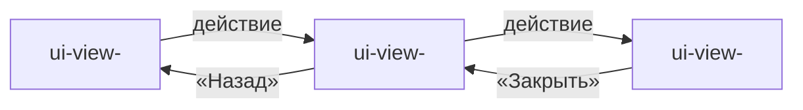

<!--
Шаблон карты навигации (nav-диаграмма) — артефакт слоя спецификаций.
Описывает ПЕРЕХОДЫ МЕЖДУ ЭКРАНАМИ (ui-view-*) на одном уровне: откуда, куда,
по какому пользовательскому действию. Это единственное место, где ссылки
«откуда в куда» указаны явно; сами ui-view-артефакты перечисляют только
исходящие переходы (раздел «Навигация»).

ЗАПРЕЩЕНО:
- описание содержимого экранов (это делает ui-view-*);
- имена компонентов фронта, маршрутов роутера, URL — это codemap/ADR;
- ссылки на код.

РАЗРЕШЕНО:
- ссылки на ui-view-* (все упомянутые во flow-диаграмме);
- mermaid flowchart / stateDiagram;
- ссылки вверх на fn-* при привязке переходов к use-case'у.

Удаляй HTML-комментарии перед сохранением.
-->
---
type: nav
slug: nav-<factory-slug>
factory: <factory-slug>
status: draft
updated: YYYY-MM-DD
---

# Карта навигации: <имя фабрики>

## Назначение

Единая карта переходов между экранами фабрики. Показывает, какие `ui-view-*` существуют и по каким пользовательским действиям осуществляется переход между ними. Читатель по этому артефакту отвечает на вопросы «откуда можно попасть на экран X» и «куда можно уйти с экрана Y».

## Диаграмма

<!--
Альтернатива — stateDiagram, если все экраны модальные и логика переходов
описывается как FSM. Выбирается по удобству чтения.
-->

## Описание переходов

| Из | В | Триггер (действие пользователя) |
|---|---|---|
| `ui-view-<A>` | `ui-view-<B>` | Кнопка/ссылка/действие |
| `ui-view-<B>` | `ui-view-<C>` | Кнопка/ссылка/действие |
| `ui-view-<B>` | `ui-view-<A>` | «Назад» / Закрытие модалки |

## Точки входа в приложение

<!-- Экраны, на которые пользователь попадает без предыдущего view.
     Например: вход на главную, открытие по диплинку. -->

- `ui-view-<slug>` — <условие входа: корневой URL, deeplink, push-уведомление>.

## Открытые вопросы

- <...>

## Связи

- Паспорт: -> as-<factory-slug>
- Экраны: -> ui-view-<slug>, -> ui-view-<slug>, ...
