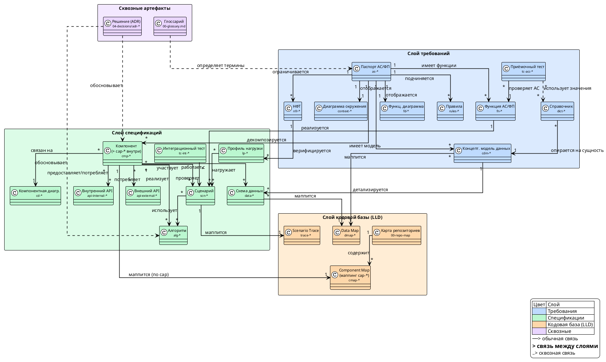

# Онтологическая диаграмма мета-модели

## Mermaid

```mermaid
graph TB
    classDef req fill:#dbeafe,stroke:#3b82f6,color:#1e3a5f
    classDef spec fill:#dcfce7,stroke:#22c55e,color:#14532d
    classDef code fill:#ffedd5,stroke:#f97316,color:#7c2d12
    classDef cross fill:#f3e8ff,stroke:#a855f7,color:#581c87
    classDef layer fill:none,stroke:#94a3b8,stroke-width:2px,stroke-dasharray:5 5,color:#475569

    subgraph CROSS["Сквозные артефакты"]
        GLOSS["Глоссарий<br/><i>00-glossary.md</i>"]
        ADR["Решение (ADR)<br/><i>04-decisions/adr-*</i>"]
    end

    subgraph REQ["Слой требований"]
        AS["Паспорт АС/ФП<br/><i>as-*</i>"]
        FN["Функция АС/ФП<br/><i>fn-*</i>"]
        NFR["НФТ<br/><i>nfr-*</i>"]
        RULES["Правила<br/><i>rules-*</i>"]
        CTX["Диаграмма<br/>окружения<br/><i>context-*</i>"]
        FD["Функциональная<br/>диаграмма<br/><i>fd-*</i>"]
        CDM["Концептуальная<br/>модель данных<br/><i>cdm-*</i>"]
        DICT["Справочник<br/><i>dict-*</i>"]
        TC_ACC["Приёмочный тест<br/><i>tc-acc-*</i>"]
    end

    subgraph SPEC["Слой спецификаций"]
        CMP["Компонент<br/>(+ возможности<br/>cap-* внутри)<br/><i>cmp-*</i>"]
        SCN["Сценарий<br/><i>scn-*</i>"]
        ALG["Алгоритм<br/><i>alg-*</i>"]
        CD["Компонентная<br/>диаграмма<br/><i>cd-*</i>"]
        API_INT["Внутренний API<br/><i>api-internal-*</i>"]
        API_EXT["Внешний API<br/><i>api-external-*</i>"]
        DATA["Схема данных<br/><i>data-*</i>"]
        LP["Профиль<br/>нагрузки<br/><i>lp-*</i>"]
        TC_INT["Интеграционный<br/>тест<br/><i>tc-int-*</i>"]
    end

    subgraph CODE["Слой кодовой базы (LLD)"]
        REPO["Карта<br/>репозиториев<br/><i>00-repo-map</i>"]
        CMAP["Component Map<br/>(маппинг cap-*)<br/><i>cmap-*</i>"]
        TRACE["Scenario Trace<br/><i>trace-*</i>"]
        DMAP["Data Map<br/><i>dmap-*</i>"]
    end

    %% Связи внутри требований
    AS -->|"имеет функции"| FN
    AS -->|"ограничивается"| NFR
    AS -->|"подчиняется"| RULES
    AS -->|"отображается"| CTX
    AS -->|"отображается"| FD
    AS -->|"имеет модель данных"| CDM
    FN -.->|"группируется<br/>по блокам"| FN
    DICT -->|"опирается на<br/>сущность"| CDM
    TC_ACC -->|"проверяет AC"| FN
    TC_ACC -->|"использует<br/>значения"| DICT

    %% Связи требования → спецификации
    AS ==>|"декомпозируется"| CMP
    FN ==>|"реализуется"| SCN
    CDM ==>|"детализируется"| DATA

    %% Связи внутри спецификаций
    CMP -->|"участвует"| SCN
    CMP -->|"реализует"| ALG
    CMP -->|"предоставляет /<br/>потребляет"| API_INT
    CMP -->|"потребляет"| API_EXT
    CMP -->|"работает с"| DATA
    CMP -->|"связан на"| CD
    SCN -->|"использует"| ALG
    LP -->|"нагружает"| SCN
    NFR ==>|"верифицируется"| LP
    TC_INT -->|"проверяет"| SCN

    %% Связи спецификации → кодовая база
    REPO -.->|"содержит"| CMAP
    CMP ==>|"маппится (по cap)"| CMAP
    SCN ==>|"маппится"| TRACE
    DATA ==>|"маппится"| DMAP
    CDM ==>|"маппится"| DMAP

    %% Сквозные связи
    ADR -.-|"обосновывает"| CMP
    ADR -.-|"обосновывает"| ALG
    GLOSS -.-|"определяет<br/>термины"| AS

    %% Стили
    class AS,FN,NFR,RULES,CTX,FD,CDM,DICT,TC_ACC req
    class CMP,SCN,ALG,CD,API_INT,API_EXT,DATA,LP,TC_INT spec
    class REPO,CMAP,TRACE,DMAP code
    class GLOSS,ADR cross
    class REQ,SPEC,CODE,CROSS layer
```

## PlantUML

```plantuml
@startuml ontology
!theme plain
skinparam linetype ortho
skinparam packageStyle rectangle
skinparam classFontSize 11
skinparam packageFontSize 13
skinparam arrowThickness 1.5

' ─── Сквозные ───
package "Сквозные артефакты" as CROSS #f3e8ff {
    class "Глоссарий\n<size:9>00-glossary.md</size>" as GLOSS #e9d5ff
    class "Решение (ADR)\n<size:9>04-decisions/adr-*</size>" as ADR #e9d5ff
}

' ─── Слой требований ───
package "Слой требований" as REQ #dbeafe {
    class "Паспорт АС/ФП\n<size:9>as-*</size>" as AS #bfdbfe
    class "Функция АС/ФП\n<size:9>fn-*</size>" as FN #bfdbfe
    class "НФТ\n<size:9>nfr-*</size>" as NFR #bfdbfe
    class "Правила\n<size:9>rules-*</size>" as RULES #bfdbfe
    class "Диаграмма окружения\n<size:9>context-*</size>" as CTX #bfdbfe
    class "Функц. диаграмма\n<size:9>fd-*</size>" as FD #bfdbfe
    class "Концепт. модель данных\n<size:9>cdm-*</size>" as CDM #bfdbfe
    class "Справочник\n<size:9>dict-*</size>" as DICT #bfdbfe
    class "Приёмочный тест\n<size:9>tc-acc-*</size>" as TC_ACC #bfdbfe
}

' ─── Слой спецификаций ───
package "Слой спецификаций" as SPEC #dcfce7 {
    class "Компонент\n(+ cap-* внутри)\n<size:9>cmp-*</size>" as CMP #bbf7d0
    class "Сценарий\n<size:9>scn-*</size>" as SCN #bbf7d0
    class "Алгоритм\n<size:9>alg-*</size>" as ALG #bbf7d0
    class "Компонентная диагр.\n<size:9>cd-*</size>" as CD #bbf7d0
    class "Внутренний API\n<size:9>api-internal-*</size>" as API_INT #bbf7d0
    class "Внешний API\n<size:9>api-external-*</size>" as API_EXT #bbf7d0
    class "Схема данных\n<size:9>data-*</size>" as DATA #bbf7d0
    class "Профиль нагрузки\n<size:9>lp-*</size>" as LP #bbf7d0
    class "Интеграционный тест\n<size:9>tc-int-*</size>" as TC_INT #bbf7d0
}

' ─── Слой кодовой базы ───
package "Слой кодовой базы (LLD)" as CODE #ffedd5 {
    class "Карта репозиториев\n<size:9>00-repo-map</size>" as REPO #fed7aa
    class "Component Map\n(маппинг cap-*)\n<size:9>cmap-*</size>" as CMAP #fed7aa
    class "Scenario Trace\n<size:9>trace-*</size>" as TRACE #fed7aa
    class "Data Map\n<size:9>dmap-*</size>" as DMAP #fed7aa
}

' ─── Связи внутри требований ───
AS "1" --> "*" FN : имеет функции
AS "1" --> "*" NFR : ограничивается
AS "1" --> "*" RULES : подчиняется
AS "1" --> "1" CTX : отображается
AS "1" --> "1" FD : отображается
AS "1" --> "*" CDM : имеет модель
DICT "*" --> "1" CDM : опирается на сущность
TC_ACC "*" --> "1" FN : проверяет AC
TC_ACC "*" ..> "*" DICT : использует значения

' ─── Связи требования → спецификации ───
AS "1" ==> "*" CMP : декомпозируется
FN "1" ==> "*" SCN : реализуется
CDM "1" ==> "*" DATA : детализируется

' ─── Связи внутри спецификаций ───
CMP "*" --> "*" SCN : участвует
CMP "1" --> "*" ALG : реализует
CMP "*" --> "*" API_INT : предоставляет/потребляет
CMP "*" --> "*" API_EXT : потребляет
CMP "*" --> "*" DATA : работает с
CMP "*" --> "1" CD : связан на
SCN "*" --> "*" ALG : использует
LP "*" --> "*" SCN : нагружает
NFR "1" ==> "*" LP : верифицируется
TC_INT "*" --> "1" SCN : проверяет

' ─── Связи спецификации → код ───
CMP "1" ==> "1" CMAP : маппится (по cap)
SCN "1" ==> "1" TRACE : маппится
DATA "*" ==> "1" DMAP : маппится
CDM "*" ==> "1" DMAP : маппится
REPO "1" --> "*" CMAP : содержит

' ─── Сквозные ───
ADR ..> CMP : обосновывает
ADR ..> ALG : обосновывает
GLOSS ..> AS : определяет термины

legend right
  | Цвет | Слой |
  |<#bfdbfe>| Требования |
  |<#bbf7d0>| Спецификации |
  |<#fed7aa>| Кодовая база (LLD) |
  |<#e9d5ff>| Сквозные |
  ──> обычная связь
  ==> связь между слоями
  ..> сквозная связь
endlegend

@enduml
```
